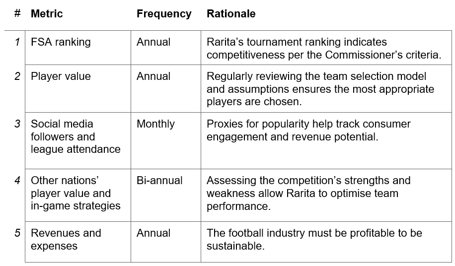

# Internation Soccer Selection - The A Team

## Executive Summary

Rarita is looking to participate in the Football and Sporting Association (FSA) League. We are hired to:
*	Construct a competitive team; and
*	Analyse the impact of a Football brand on Rarita’s economy over the next 10 years.

In constructing a competitive team, below were the objectives:
*	Rarita ranking top ten of the FSA within the next five years; and
*	Rarita having a high probability of achieving a championship within the next 10 years.

The team selected for Rarita is comprised of 5 to 8 players for each position. The team will have a 99% probability of ranking within top 10 members of the FSA for the next 5 years and 95% of probability of placing in the top 3 within the next 10 years.
Over the 10 years, the investment of 995mil Doubloons allows Rarita to construct a competitive team without additional funding. While the venture is projected to remain profitable in most scenarios, consistent poor performance or a lack of consumer interest may result in lower revenue growth and create a going concern. 

## Team Selection

###	Steps
1.	Determined player's value based on playing statistics, position, and league (important indicator of the quality of opposition). 
2.	Maximised the total value of a team whilst constraining the total player salary, number of players in a position and proportion of allocated value for each position.
3.	Applied model to different salary caps to fit a polynomial equation linking salary and value.
.png)
4.	After establishing a strong link between underlying team value and performance, determined the probability of placing top 10 using team data from the 2021 tournament - probabilities were found by discounting the total team value back to 2021 at the superimposed inflation rate.
%20Value%20for%202021%20Tournament%20Teams%20vs%20Tournament%20Placing.png)
%2C%20Top%2010%20but%20Not%20Top%203%20(Top%2010)%20or%20Outside%20Top%2010%20(Bottom).png)
5. Minimised the net present value (NPV) of the total player salaries each year (includes return on investment and superimposed inflation), whilst meeting the competitiveness requirement.
6.	With the team budget for each year confirmed, players were selected.

### Qualitative Constraints

To meet the competitiveness requirement, regardless of return on investment (ROI) of unspent monies, increasing spending by an order of magnitude for two of the years (in the first 5 years) is required . However, large player budgets in 2025 and 2026 are ideal given other considerations. 

*	Large player salaries early in the venture is not prudent because:
**	support structures for the team are yet to be tried and tested;
**	public typically have a low expectation of performance early in the venture, however, mediocre performance following success could reduce morale and support; and
**	three years of low spending enables early validation of the model and assumptions without exposing the venture to significant risk.

*	If the team proves successful in 2025 or 2026 it may garner strong national support and interest, inducing higher team investment from 2027-2031, and leading to a greater chance of future tournament success and further economic benefits.

### Results 

The anticipated spending on players for each year and the subsequent probabilities of placing are shown below:

%2C%20top%2010%20including%20Top%203%20(top%2010)%20or%20outside%20top%2010%20(bottom)%20for%20tournament%20position%20using%2012%25%20ROI.png)

The players chosen for the 2022 tournament are found [Here](player_list_2022.PNG).

### Monitor

Key metrics to monitor the success of the strategy are:

## Economic Impacts

Your Pages site will use the layout and styles from the Jekyll theme you have selected in your [repository settings](https://github.com/segz6478/Soccer-Selection-A-Team/settings/pages). The name of this theme is saved in the Jekyll `_config.yml` configuration file.

### Strategy

Having trouble with Pages? Check out our [documentation](https://docs.github.com/categories/github-pages-basics/) or [contact support](https://support.github.com/contact) and we’ll help you sort it out.
